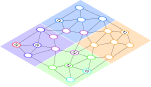

+++

title = "Talk CommonWears"
description = "Talk CommonWears"
outputs = ["Reveal"]
aliases = [
    "/guide/"
]

+++

# Sparse Self-Federated Learning

[Davide Domini](mailto:davide.domini@unibo.it), PhD Student

Talk CommonWears 2025

 

---

# Motivation

 **Computing devices** are more and more *ubiquitous* in every day life, enabling lots of *potential applications*,   such as: crowd monitoring, smart surveillance, air quality monitoring, and many more.

















--- 

# Classic Machine Learning Workflow 

--- 

# Challenges

 <i class="fa-solid fa-xmark" style="color: red;"></i> These system are <em>complex</em>, engineering <em>collective behaviors</em> is a non trivial task 

 <i class="fa-solid fa-xmark" style="color: red;"></i> <em>Laws</em> put more <em>constraints</em>, for instance GDPR in europe for privacy 

 <i class="fa-solid fa-xmark" style="color: red;"></i> <em>Heterogeneity</em> emerges both in the devices and the data generated by them 

--- 

# Federated Learning Workflow













---

# Pros and cons 

 





<h2> Centralized FL </h2>

    
 <i class="fa-solid fa-check" style="color: green;"></i> Reduces privacy concerns 

    
 <i class="fa-solid fa-xmark" style="color: red;"></i> Single point of failure 

    
 <i class="fa-solid fa-xmark" style="color: red;"></i> Need for a central trusted entity 

    
 <i class="fa-solid fa-xmark" style="color: red;"></i> Heterogeneity 





<h2> P2P FL </h2>

    
 <i class="fa-solid fa-check" style="color: green;"></i> Reduces privacy concerns 

    
 <i class="fa-solid fa-check" style="color: green;"></i> No single point of failure 

    
 <i class="fa-solid fa-check" style="color: green;"></i> No need for a central trusted entity 

    
 <i class="fa-solid fa-xmark" style="color: red;"></i> Heterogeneity 

    
 <i class="fa-solid fa-xmark" style="color: red;"></i> Communication overhead 





---

# Clustered Federated Learning





{}

 <i class="fa-solid fa-angle-right" style="color: #22373b;"></i> <em>Assumption:</em> clients can be divided in clusters (IID data within each cluster) 

 <i class="fa-solid fa-angle-right" style="color: #22373b;"></i> <em>Multiple models </em> are trained to target various local distributions 

 <i class="fa-solid fa-angle-right" style="color: #22373b;"></i> <em>Similarity measures:</em> loss based, gradient based, weight based 

{}





{}

 <i class="fa-solid fa-xmark"style="color: red;"></i> Clustering is performed by a central server 

 <i class="fa-solid fa-xmark"style="color: red;"></i> Number of clusters must be defined a priori 

{}





--- 

# Proximity-based Federated Learning

















 
 
 

<!-- <small style="text-align: left">  -->
[1] Domini D., Aguzzi G., Esterle L., Viroli M. "Field-based Coordination for Federated Learning." Coordination 2024. 
[2] Domini D., Farabegoli N., Aguzzi G., Viroli M., Esterle L. "Proximity-based Self-Federated Learning." ACSOS 2024.
<!-- </small>  -->

<!-- 


  
  
  


 -->

--- 

# Algorithm overview

    





  
  

  


---

# Sparse Neural Networks

 

 

 <i class="fa-solid fa-play"style="color: black;"></i> <em> Different sparsification methods: </em> pre-pruning, post-pruning, sparse evolutionary training 

--- 

<!-- # Challenges of SNN in FL -->

# Challenges and future work

 

 <i class="fa-solid fa-question"style="color: #e07f00;"></i> SNN may evolve differently on each device, how can we merge models that are architecturally different? 

 <i class="fa-solid fa-question"style="color: #e07f00;"></i> How to measure neural network similarity avoiding loss-based methods? 

 <i class="fa-solid fa-question"style="color: #e07f00;"></i> What is the impact of sparsification on self-federations? 

 <i class="fa-solid fa-question"style="color: #e07f00;"></i> How to define the maximum acceptable level of sparsity? 

