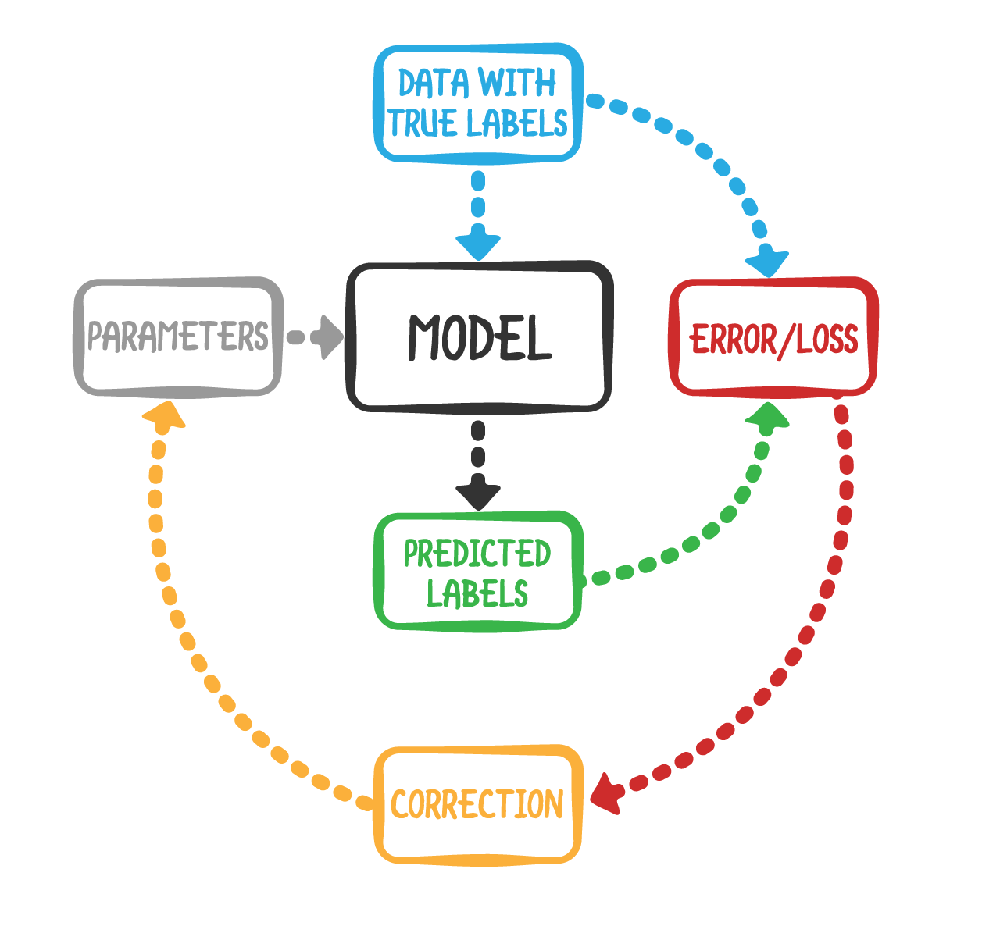
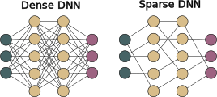

+++

title = "Talk CommonWears"
description = "Talk CommonWears"
outputs = ["Reveal"]
aliases = [
    "/guide/"
]

+++

# Sparse Self-Federated Learning

[Davide Domini](mailto:davide.domini@unibo.it), PhD Student

Talk CommonWears 2025

 

---

# Motivation

 **Computing devices** are more and more *ubiquitous* in every day life, enabling lots of *potential applications*,   such as: crowd monitoring, smart surveillance, air quality monitoring, and many more.

















--- 

# Classic Machine Learning Workflow 

--- 

# Challenges

 <i class="fa-solid fa-xmark" style="color: red;"></i> These system are <em>complex</em>, engineering <em>collective behaviors</em> is a non trivial task 

 <i class="fa-solid fa-xmark" style="color: red;"></i> <em>Laws</em> put more <em>constraints</em>, for instance GDPR in europe for privacy 

 <i class="fa-solid fa-xmark" style="color: red;"></i> <em>Heterogeneity</em> emerges both in the devices and the data generated by them 

--- 

# Federated Learning Workflow













---

# Sparse Neural Networks

 

